```{r setup, include=FALSE}
knitr::opts_chunk$set(echo = TRUE,
                      warning = FALSE,
                      message = FALSE)
library(fontawesome)
```

```{r child="title_slide.Rmd"}

```

---
# Version control

.pull-left[
 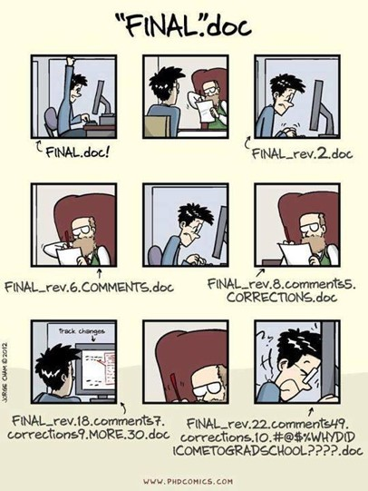
]

--

.pull-right[

## Why?

- **Go back** in time
  
- **Collaborate** in teams -> Who did what and why?

- Don't loose **overview** of your project

]

---
# Version control

.pull-left[
 
 ]
 
.pull-right[
## How?

- **Complete and long-term history** of every file in your project

- **Safe** (e.g. no accidental loss of versions)

- **Easy** to use

- **Overview and documentation** of all changes

- Repository on **remote server** for everyone to access

- **Offline and asynchronous** work should be possible

]

---
# Version control with git

- Complete and long-term history of every file in your project `r fontawesome::fa("check-square", fill = "green")`

.pull-left[
**Git is a software that**

- Tracks changes in any set of files

- Stores snapshots (i.e. commits) of your project files
  - like a mini-filesystem
]

.pull-right[
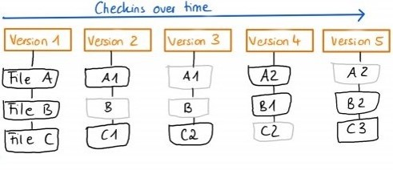
]

---
# Version control with git

- Complete and long-term history of every file in your project `r fontawesome::fa("check-square", fill = "green")`

- Safe (e.g. no accidental loss of versions) `r fontawesome::fa("check-square", fill = "green")`

- Repository on remote server for everyone to access `r fontawesome::fa("check-square", fill = "green")`

--
.pull-left[
**Distributed version control system**

  - Idea: many local repositories synced via one remote repo
  - Every computer has full full-fledged version of repo with entire history
  - Additional "backup" on a remote server
  - Git makes it hard for you to delete something accidentally]
  
.pull-right[.right[
]]


---
# Version control with git

- Complete and long-term history of every file in your project `r fontawesome::fa("check-square", fill = "green")`

- Safe (e.g. no accidental loss of versions) `r fontawesome::fa("check-square", fill = "green")`

- Repository on remote server for everyone to access `r fontawesome::fa("check-square", fill = "green")`

- Easy to  use `r fontawesome::fa("check-square", fill = "green")`

--

  - There is some practice necessary to get the concepts
  - A lot of documentation
  - Easy to use git clients

---
# Version control with git

- Complete and long-term history of every file in your project `r fontawesome::fa("check-square", fill = "green")`

- Safe (e.g. no accidental loss of versions) `r fontawesome::fa("check-square", fill = "green")`

- Repository on remote server for everyone to access `r fontawesome::fa("check-square", fill = "green")`

- Easy to  use `r fontawesome::fa("check-square", fill = "green")`

- Overview and documentation of all changes `r fontawesome::fa("check-square", fill = "green")`

--

  - For every change: Who, What, When, Why
  
---
# Version control with git

- Complete and long-term history of every file in your project `r fontawesome::fa("check-square", fill = "green")`

- Safe (e.g. no accidental loss of versions) `r fontawesome::fa("check-square", fill = "green")`

- Repository on remote server for everyone to access `r fontawesome::fa("check-square", fill = "green")`

- Easy to  use `r fontawesome::fa("check-square", fill = "green")`

- Overview and documentation of all changes `r fontawesome::fa("check-square", fill = "green")`

- Offline and asynchronous work should be possible `r fontawesome::fa("check-square", fill = "green")`

--

  - Complete local copy -> can be uploaded to remote any time

---
# This workshop

Git is a huge topic because and git is very powerful. Most of the things are best to learn as you need them.

--

**Aim of this workshop:** 

Get started with simple workflows. Learn the rest as you need it.

--

## Session 1

- Introduction to git concepts
- Simple git workflow for your projects (Local + Remote)

## Session 2

- Collaboration with others
  - Branching and merging
- Using git with R and RStudio

---
# Git core concepts I

## Some terminology

.pull-left[

- **Repository / Repo:** Database of the project (a `.git` folder in your project)
  - **local:** on a local machine (e.g. your computer)
  - **remote:** on a server (e.g. Github)
  
- **Commit:** a change to the repository

- **Branches:** different versions of a repo within a repo

- **Merge:** combine two branches
 ]
.pull-right[
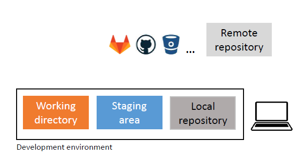
]

---
# Git core concepts II

A git repository does not contain the files in a version that you can just open and edit.

--

.pull-left[
- **Repository:** 
  - Database of the project
  - Stores *all versions* of your project
  
- **Working directory:** 
  - Checkout *one version* of the project
  - Files can be edited here and then added into the repository
  
- **Staging area (index):** 
  - Collect changes to files here before commiting
  - Info of what goes into the next commit
  
]

.pull-right[
  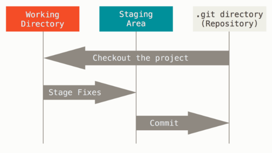
]


---
class: inverse

# Basic git workflow for working alone

I will show you everything in the command line. There are also GUI programs for git that you can switch to but the concepts are (in my opinion) better learned in the terminal.

.bottom[
.pull-left[

`git init`

`git add`

`git commit`

`git push`
]
]


---
# Starting situation

- Local working directory (i.e. a folder) with or without files

.center[]


---
# Step 1: Initialize a git repository `git init`

.center[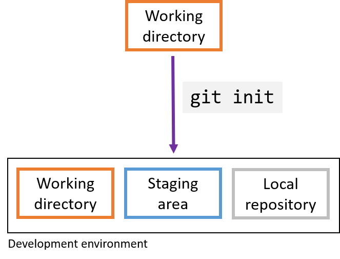]

---
# Step 1: Initialize a git repository `git init`

To use git in any project, just navigate to the project folder and run `git init`

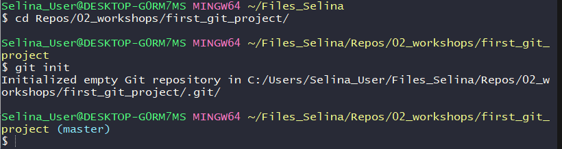

--

This initializes a (hidden) `.git` folder that contains your git repository.

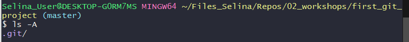

- You don't have to touch anything that is in this folder

---
# Step 2: Modify files and stage changes `git add`

.pull-left[
- Git detects any changes in the working directory and marks them as 

  - untracked
  - modified
  - deleted
  
]

--

.pull-right[
  
  
]

--

- see whats going on with `git status`

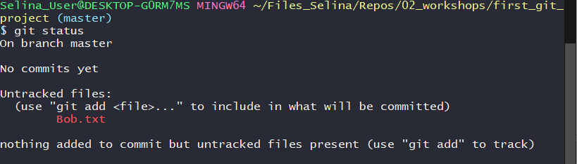
---
# Step 2: Modify files and stage changes `git add`

.pull-left[
- Add files to the staging area with

  - Specific file: `git add <filename>`
  - All changed files: `git add .`
]

.pull-right[
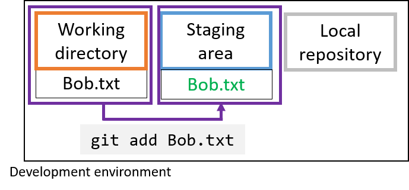
]

--

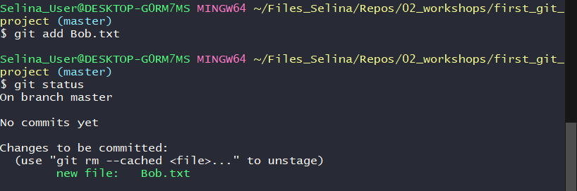

---
# Step 3: Commit changes `git commit`

.pull-left[
- Commits are basically snapshots of your projects

- Commit work from staging area to local repository
  - First, collect meaningful chunks of work in the staging area, then commit

- After a commit, your changes are part of your project's git history
]
.pull-right[
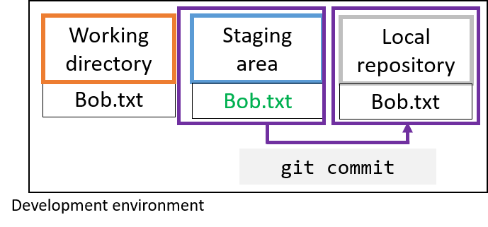
]

<!-- 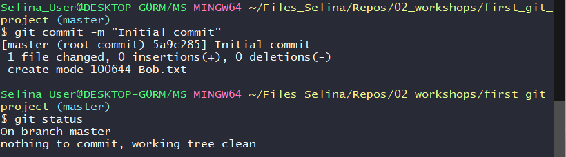 -->


---
# Commit messages

.footnote-right[Comic by [xkcd](https://xkcd.com/1296/)]
- Every commit needs a commit message
- Good commit messages are essential to make good use of git!


.center[]

--

- **One line commit messages** can be given directly in the command line:
  - `git commit -m "Your very nice commit message"`
- **More complex commit messages** are better entered in a text editor:
  - `git commit` and a text editor will automatically open for you message
  
---
# Looking at the git history `git log`

- List of all commits with hash, author, date, commit message, ...
- State of local and remote repository branches

--

- `git log` for normal view

- `git log --oneline` for a compact version of log

- `git log --graph` for a graphical representation (interesting if you have a branching workflow)

---
# Explore differences with `git diff`

- `git diff` show changes in the working directory

- `git diff --staged` changes in staging area

- `git diff <commit_hash>^!` compare to one commit before

- `git diff <commit_hash_1> <commit_hash_2>` compare commit 1 and 2
  - e.g. `git diff 8af2ff 87a4ad`

---
# Short recap

We have

- Added a file to the working directory

- Committed changes to local repository via the staging area


.center[]

--

**Now: Share changes with a remote repository**

---
# Step 4: Create a remote repository

- E.g. on Github, Bitbucket or Gitlab

.center[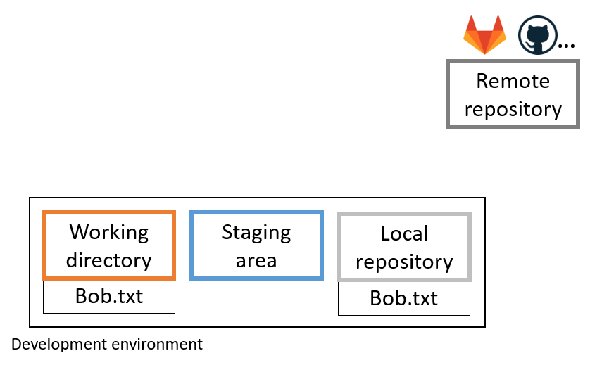]

---
# Step 5: Connect local and remote repository

- Tell the local repository where to push its changes to

  - `git remote add <remote_name> <remote_address>`
  
--

- Default remote name is often `origin` but could be anything else

--

- The address of the remote can be found on Github

--

- You can chose SSH or HTTPS protocol
  - Depending on this, choose the repository address

Example:

`git remote add origin git@github.com:selinaZitrone/git_test_project.git`

---
# Step 6: Share changes with a remote repository `git push`

- Push your local changes to the remote with `git push`

- The first time, you need to tell git to which remote branch, your local branch should be pushed

  - `git push --set-upstream <remote_name> <remote_branch_name>`
  
  - `git push --set-upstream origin main`

---
# Get a repo copy to another machine `git clone`

.center[]

- Get a copy of your own repository on a different machine
- Get the repository from somebody else

---
# Get a repo copy to another machine `git clone`


.pull-left[
- Locally, working directory is created, git repository is copied and checked out

]

.pull-right[

.center[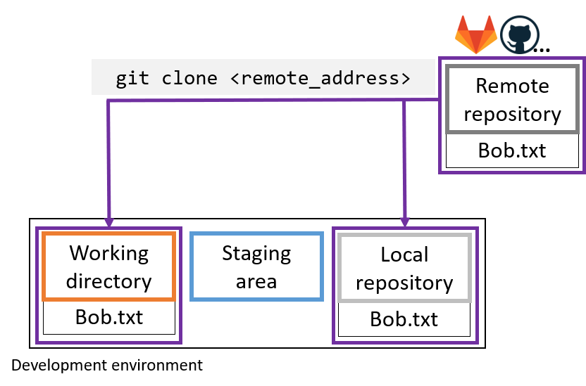]

]

- Clone a remote repository with <br>
`git clone git@github.com:{your_username}/{your_project}`


---
# Sync changes with the remote `git pull`

.pull-left[

- Local changes, publish to remote: `git push`

- Remote changes, pull to local: `git pull`

]

.pull-right[

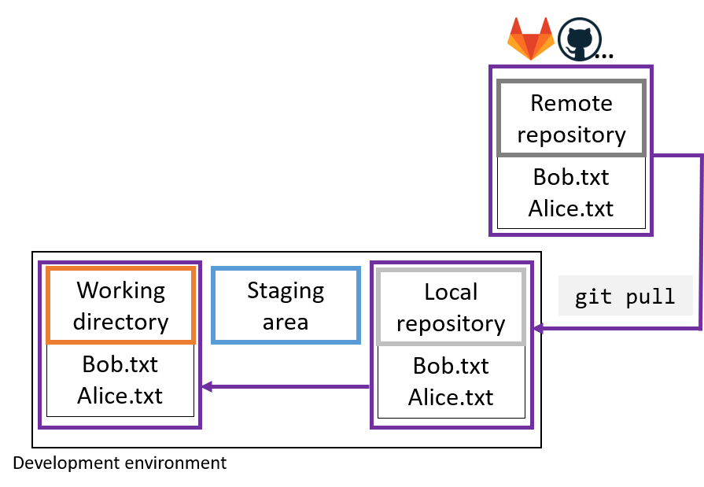
]
---
# Ignoring files in `.gitignore`

- Use a `.gitignore` file to list files/folders that you don't want to track with git

--

- Useful to ignore e.g.
  - Compiled code and build directories
  - Log files 
  - Hidden system files
  - Personal IDE config files
  - ...
  
--

## How to ignore files/folders?

- **Step 1: **  Create a file with the name `.gitignore` in working directory

--

- **Step 2: ** Add all files and directories you want to ignore to the `.gitignore` file

---
# Ignoring files: Example

```
*.html    # ignore all .html files
*.exe     # ignore all .exe files

debug.log # ignore the file debug.log

build/    # ignore all files in subdirectory build
```

See [here](https://www.atlassian.com/git/tutorials/saving-changes/gitignore) for more ignore patterns that you can use.

---
# Recap

## Basic git workflow (Start local)

- `git init`: initialize a repository

- `git add`: add changes to staging area

- `git commit` / `git commit -m`: Commit changes to repository

--

- Create a remote repository

- `git add remote <remote_name> <remote_address>`: Add the remote to the local repository

--

- `git push --set-upstream origin master`: push local changes to remote branch
  - `-u origin master` only when pushing for first time. Afterwards just `git push`

---
# Recap

## Basic git workflow (Start remote)

- `git clone`: Clone remote repository

- `git add`: add changes to staging area

- `git commit` / `git commit -m`: Commit changes to repository

- `git push`: publish changes on the remote

- `git pull`: pull changes from the remote

---
# Recap

## Additional useful things

- `git log`: look at commit history

- `git diff`: look at differences between versions

- use a `.gitignore` file to list files/folders that you don't want tracked

---
# What if I don't want to use the command line?

- There are many git GUI clients

  - Most IDEs have a git GUI integrated (e.g. RStudio -> tomorrow)
  
- GUI clients can be used in combination with the command line

- My recommendation: First understand git concepts in command line, then move on to a GUI client if you want

---
# Example: Github Desktop

- For MacOS and Windows

- Easily connected to your Github account, but also works for GitLab repos etc.

- I personally don't use it, but it looks pretty good and simple to use

---
# Example: Github Desktop

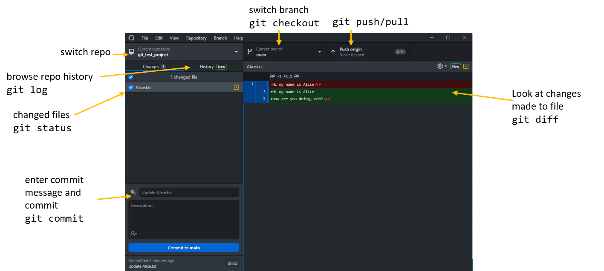

---
# More on the topic

Thanks to this blogpost from which all the examples and explanations are taken:

[Learn git concepts, not commands](https://dev.to/unseenwizzard/learn-git-concepts-not-commands-4gjc): Blogpost that explains really well the concepts of git, also more advanced ones like `rebase` or `cherry-pick`.

[How to write good commit messages](https://cbea.ms/git-commit/): Blogpost that explains why good commit messages are important and gives 7 rules for writing them.

[Git cheat sheet](https://education.github.com/git-cheat-sheet-education.pdf): Always handy if you don't remember the basic commands

[Download Github Desktop](https://desktop.github.com/)

---
class: inverse

.center[.large[# Thanks for you attention :)]]

## Questions?

## Find exercise [here](../how_to_01_basic_git_workflow.html)