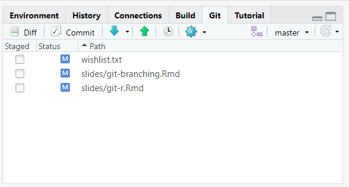
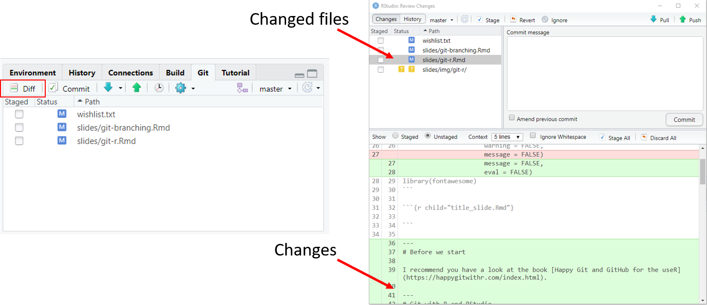
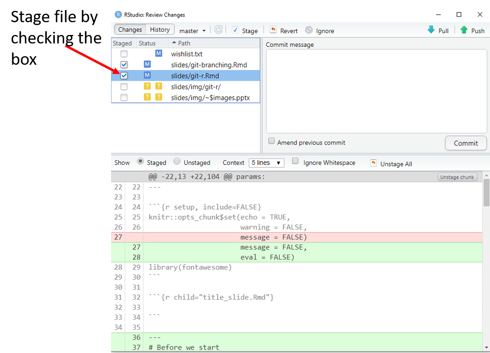
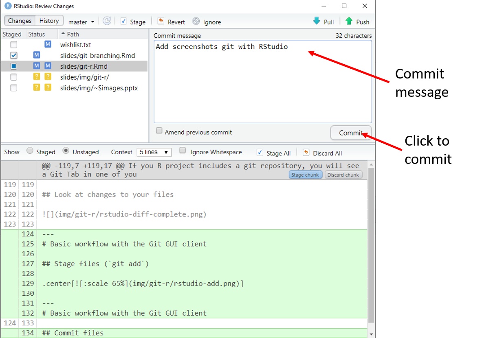
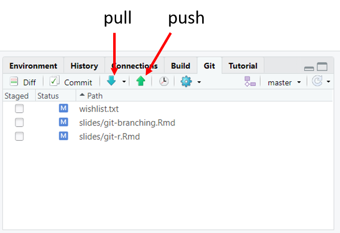
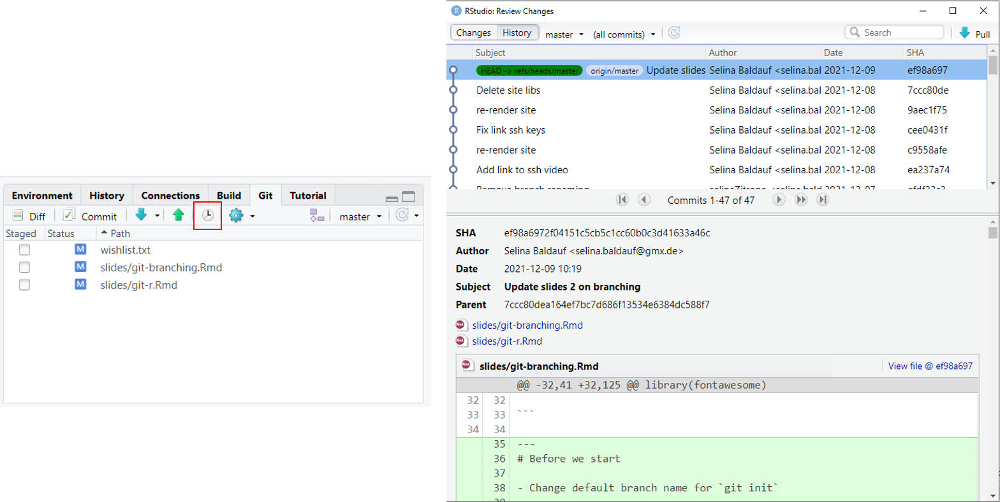
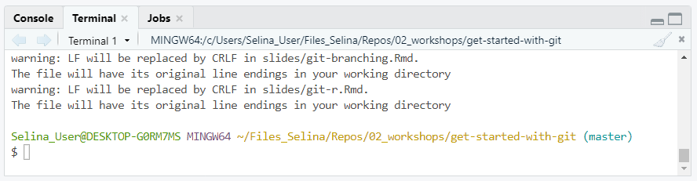

```{r setup, include=FALSE, eval=TRUE}
knitr::opts_chunk$set(echo = TRUE,
                      warning = FALSE,
                      message = FALSE,
                      eval = FALSE)
library(fontawesome)
```

```{r child="title_slide.Rmd", eval=TRUE}

```


---
# Before we start

I recommend you have a look at the book [Happy Git and GitHub for the useR](https://happygitwithr.com/index.html).

---
# Git with R and RStudio

## Part I

`{usethis}` package for easy workflow with R functions

## Part II

Git GUI client in RStudio

---
# The `usethis` package

Install from CRAN and load:

```{r}
install.packages("usethis")
library(usethis)
```

--

## Add `usethis` to `.Rprofile` (optional)

- Then it's loaded automatically if you open R
- Only do this for packages that are not needed in your scripts 
  - Otherwise reproducibility is compromised

Follow [task]() to see how to do this

---
# Authentication SSH or HTTPS

- You can chose either of the two and add to your `.Rprofile` which one you prefer as a default

- SSH needs SSH key setup

- HTTPS needs a Personal Access Token (PAT)
  - can be easily created with `usethis`
  
Follow [task]() to see how to do this

---
# `usethis` git functions

Use R function to setup your RStudio project with git and GitHub

--

```{r}
# Step 1: Create an empty RStudio project
usethis::create_project(path = "where/the/project/should/be")
```

--

```{r}
# Step 2: Initialize a git repository with .gitignore
usethis::use_git()
```

--

```{r}
# Step 3: Create and connect a Github repository (here private)
usethis::use_github(private = TRUE)
```

---
# The Git GUI client in RStudio

If you R project includes a git repository, you will see a Git Tab in one of your RStudio panes (by default in the top right):

.center[]

---
# Basic workflow with the Git GUI client

## Look at changes to your files



---
# Basic workflow with the Git GUI client

## Stage files (`git add`)

.center[]

---
# Basic workflow with the Git GUI client

## Commit files

.center[]

---
# Basic workflow with the Git GUI client

## Push and pull

.center[]

---
# Other things to explore

## Browse commit history of all branches

.center[]

---
# Other things to explore

## Many more things that are best discovered when needed.

--

General tip: if there are things that you can't do with the GUI, just use the command line for this one thing.

--

Find command line (Terminal inside RStudio):



Change terminal (e.g. to Git bash) under `Tools -> Global options -> Terminal`

---
class: inverse

.center[.large[# Thanks for you attention :)]]

## Questions?

## Find exercise [here](../how_to_02_git-collab.html)

