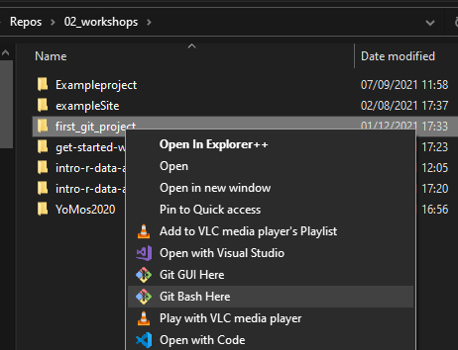
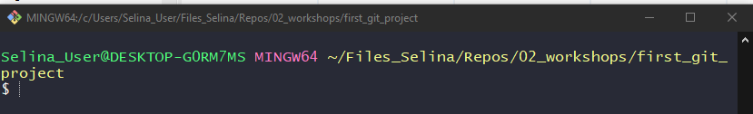
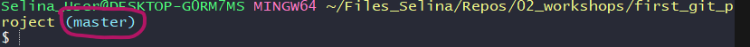
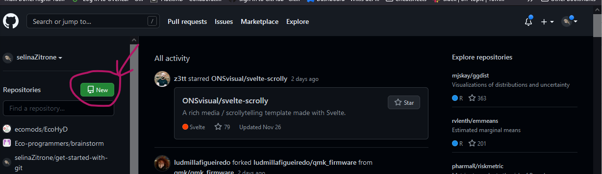
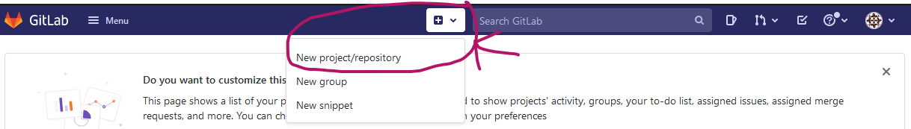

# Simple git workflow step by step

The following describes a typical git workflow starting with a local and later adding a remote repository.

*The italic text refers to Windows users.*


## Step 0: Minimal git configuration

Let git know who you are in order to "sign" your commits correctly. 
You can set git configurations locally or globally.
To see if you already have your git configured run

```
git config --global -l
```

If you don't yet see a `user.name` or `user.email` field, run the following to configure:

```
git config --global user.name <your_user_name>
git config --global user.email <your_user_email>
```

Use the user name and email that you also use in your Gitlab/Github/... This way the names in the commits are consistent.

## Start with a working directory

The working directory can be a project that already contains files or a completely empty folder. To follow this tutorial, create an empty folder `test_git` using you operating system's file explorer or, if you are familiar with it, the terminal.

## Navigate into the working directory

Open the terminal. 

*If you are working on Windows, open the `Git bash` terminal that comes with your installation of git. Just search the App with the Windows search tool.*

Navigate to the working directory that you just created.

You can use `cd /path/to/navigate/to` to navigate into a specific path. If you want to go back one level, use `cd ..`.

*On Windows, you can right click on the folder that contains your working directory and then click on `Git Bash Here`*



To see if you are in the correct directory, have a look at the path that is written on top. It should show the directory that you just created. Something like this:



## Step 1: Initialize empty git repository

To initialize a git repo in the working directory run 

```sh
git init
```

This created a hidden folder `.git` in your working directory. 
The terminal now indicates that you are using git by indicating the branch that you are currently on. The default branch that is usually created by git is called `master` or `main`.



You can check the current status of your git repository by calling

```sh
git status
```

Right now, there should be nothing to commit.

## Step 2: Add a file to the git repository

Create a file `Bob.txt` in your working directory and add the following text to it:

```
Hello, this is Bob. How are you?
```

Save and close the file.

Now have a look at 

```sh
git status
```

again. `Bob.txt` is now an untracked file. To add it to the staging area, run

```
git add Bob.txt
```

Run

```
git status
```

again, to see how the status of the file changed. It is now ready to be committed.

## Step 3: Commit `Bob.txt` to the repository

To commit the file run

```
git commit -m "Initial commit"
```

Run

```
git status
```

to see how the status has changed now.

Run

```
git log
```

To see how the commit that you just did looks like.

## Step 4-6: Create a remote repository and push local changes

Create a new remote repository on Gitlab or [Github](https://github.com/) (whichever you already use or prefer to use).

### Github

On Github, click on the green `New` button on the left on the start screen:



Now Github will give you some options for setting up your remote repository and it will already provide you some code to do so.
Since we already created a local repository, we want to chose the option `push an existing repository from the command line`

You can either copy the code that Github suggests you, or you can enter it manually  in the command line. The example below is for my test repository. For yours, the address of the remote will of course be different.

```sh
# Add the repo on github as a remote with the name origin
git remote add origin git@github.com:selinaZitrone/git_test_project.git
# Rename the current branch to main (the default branch name on Github)
git branch -M main
# Push your local changes to github
git push -u origin main
```

### Gitlab

On Gitlab, click on the little `+` symbol on top, chose `New project/repository` and `Create blank project`.



Give your git project a name (for this tutorial `git_test_project`) and decide whether you want to make it public or private.

After you click on `Create repository`,Gitlab will bring you to the repositories main page.

Scroll a bit down and on the readme page, you find instructions on how to add this repo as a remote to you local repo. 

```sh
# Add the repo on gitlab as a remote with the name origin
git remote add origin git@gitlab.com:selinaBaldauf/test_project.git
# Rename the current branch to main (the default branch name on Github)
git branch -M main
# Push your local changes to gitlab
git push -u origin main
```

# Other things to try

## Add a gitignore file

- put a pdf file in your rep
- look at git status
- Add a gitignore file
- ignore pdf files
- look at git status again

## Add another commit

- Change something in Bob.txt
- stage it
- look at the diff with git diff --staged
- commit it
- compare this commit to the previous one
- push to origin

## Look at the log

Use `git log` to look at the log of your current repository
