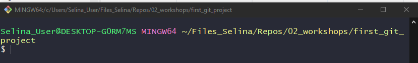
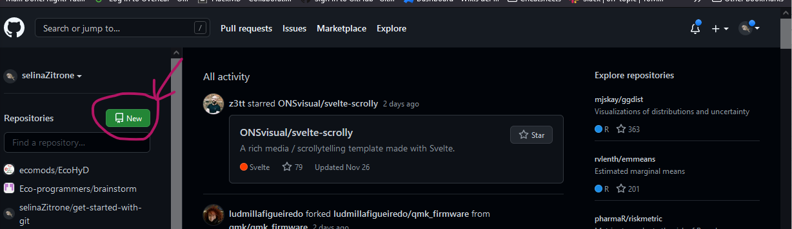
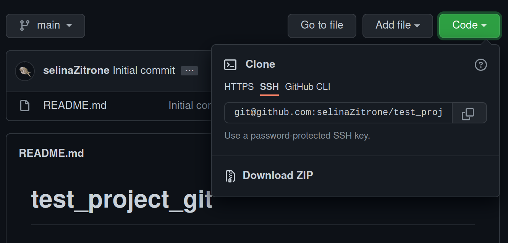

The following describes a simple git workflow starting with a local repo.

*The italic text refers to Windows users.*

## Step 0: Minimal git configuration

Let git know who you are in order to sign your commits correctly. 
Git configuration can be set locally (just for the current repo) or globally (default for all repos if no local config is specified).
To see if you already have your git configured run

```
git config --global -l
```

If you don't yet see a `user.name` or `user.email` field or you get a message, that the `.gitconfig` file does not exist, run the following to configure:

```
git config --global user.name <your_user_name>
git config --global user.email <your_user_email>
```

Use the user name and email that you also use in your Gitlab/Github here.

## Start with an empty working directory

In general, the working directory can be a project that already contains files or a completely empty folder like in this example. 
Create an empty folder called `first_git_project` using your operating system's file explorer or the terminal if you are familiar with it.

Open the terminal and navigate into the working directory that you just created.

*If you are working on Windows, open the `Git bash` terminal that comes with your installation of git. Just search the App with the Windows search tool.*

You can use `cd /path/to/navigate/to` to navigate into a specific path. If you want to go back one level, use `cd ..`.

*On Windows, you can right click on the folder that contains your working directory and then click on `Git Bash Here`*


To see if you are in the correct directory, have a look at the path that is written on top. It should show the directory that you just created. Something like this:



## Step 1: Initialize empty git repository

To initialize a git repo in the working directory run 

```
git init
```

This creates a hidden folder `.git` in your working directory. 
The terminal now indicates that you are using git by indicating the branch that you are currently on. The default branch that is usually created by git is called `master` or `main`.


Check the current status of your git repository by running

```sh
git status
```
Right now, there should be nothing to commit.

## Step 2: Add a file to the git repository

Create a file `Bob.txt` in your working directory and add the following text to it:

```
Hello, this is Bob. How are you?
```

Save and close the file.

Now have a look at the repository with

```
git status
```

`Bob.txt` is now an untracked file that we can add to the staging area with

```
git add Bob.txt
```

Run

```
git status
```

again, to see how the status of the file has changed. It is now ready to be committed.

## Step 3: Commit `Bob.txt` to the repository

To commit the file run

```
git commit
```

Wait for your default text editor to open, and add a commit message. Close the texteditor.

Look how the status of the file has changed again with

```
git status
```

To see how the commit that you just did looks like, run

```
git log
```

To see how the commit that you just did looks like.

## Step 4: Create a remote repository and add it as a remote

Create a new remote repository on [Gitlab](https://gitlab.com/users/sign_in) or [Github](https://github.com/) (whichever you already use or prefer to use).

### 4A) Github

To do this on Github, go to the website, log in and click on the green `New` button on the left of the start page:



Enter a repository name (e.g. `first_git_project`), select if it should be private or public and add a description if you like.
Set the check mark for adding a `README.md` file.

Github will now bring you to the newly created repository.

**Add the repository on Github as a remote to your local repository**

To add this newly created repository as a remote to your local repository, you first have to copy the remote's address.

You can find and copy the address by clicking on the green `Code` button on the right. 
Choose the SSH address.


Now switch back to your local terminal and add this address as a remote with the name origin.
(Replace the address below with the address of your personal repository)

```
git remote add origin git@github.com:selinaZitrone/git_test_project.git
```

### 4B) Gitlab

Log in to Gitlab and on the start page, click on the little `+` symbol on top. Choose `New project/repository` and then `Create blank project`.


Enter a repository name (e.g. `first_git_project`), select if it should be private or public and add a description if you like.
Set the check mark for adding a `README` file.

Click on `Create project` and Gitlab will bring you to the repositories main page.

To get the address of the remote repository click on the blue button `Clone` on the right. Copy the address under `Clone with SSH`

Now switch back to your local terminal and add this address as a remote with the name origin.
(Replace the address below with the address of your personal repository)

```
git remote add origin git@gitlab.com:selinaZitrone/git_test_project.git
```

# Step 5: Push local changes to the remote

Before pushing your local changes to the remote, you can change the default branches name from master to main by running

```
git branch -M main
```

Now you can push your changes to the remote by running

```
git push -u origin main
```

Now you might get a warning, that the remote contains commits that you don't have locally. 
In this situation, git prevents you from pushing. 

So first, you need to get all the changes from the remote (i.e. the `README` file that we initialized on Github/Gitlab).

Just run

```
git pull
```

Now you should be able to run

```
git push
```

# Other things to try

## Add a gitignore file

- put a pdf file in your rep
- look at git status
- Add a gitignore file
- ignore pdf files
- look at git status again

## Add another commit

- Change something in Bob.txt
- stage it
- look at the diff with git diff --staged
- commit it
- compare this commit to the previous one
- push to origin

## Look at the log

Use `git log` to look at the log of your current repository
