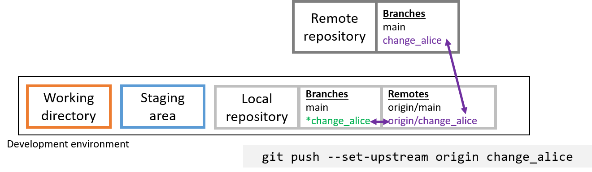
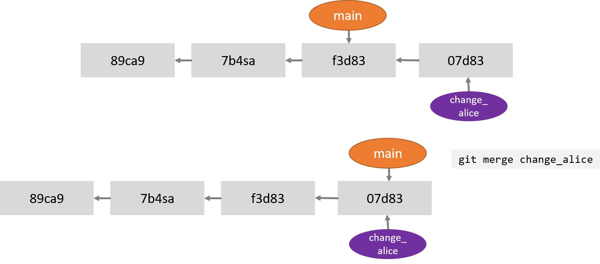
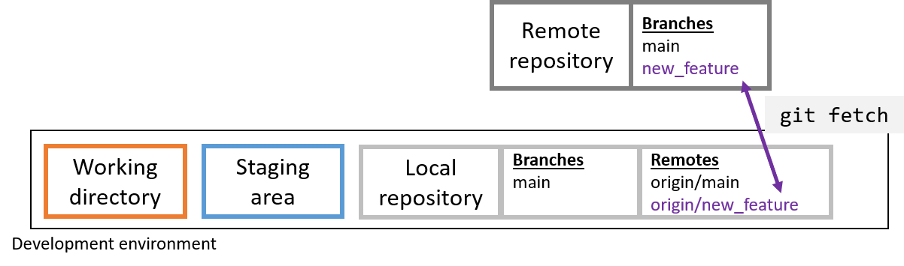
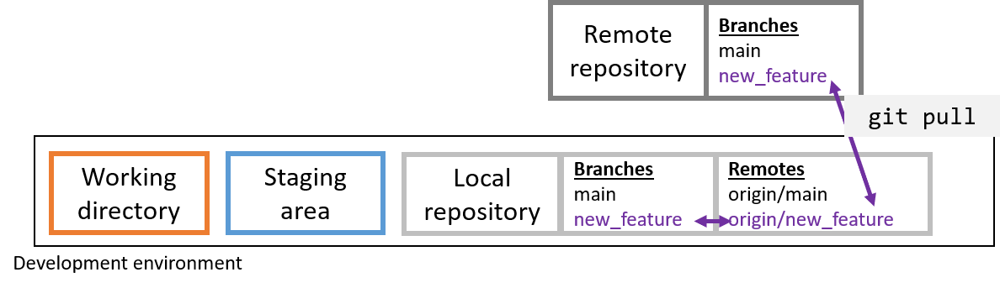

```{r setup, include=FALSE}
knitr::opts_chunk$set(echo = TRUE,
                      warning = FALSE,
                      message = FALSE)
library(fontawesome)
```

```{r child="title_slide.Rmd"}

```

---
# Collaboration with git

## Simple option

- One remote and multiple local repos
- Everyone works on same branch and use push and pull to sync

--

This works good if

- Repo is not updated often
- One person is primarily pushes, others mostly pull
- No need for discussing code
  - everything that is pushed is integrated in the repo
  
--
  
**Problems with this approach**

- If more people push often -> conflicts
- Not possible to improve on code before integration
- Not possible to just "try something out"

---
# Collaboration with git

## More complex workflow

- One remote and multiple local repos
- One main branch that only has code that is agreed upon and tested
- Everyone works on separate branches and requests a merge if they are finished

--

**Advantages**

- It can be guaranteed that main always works
- Code can be reviewed before it's integrated
- Potential conflicts don't have to be solved on the main branch

--

Before we can do this, we need to understand the concept of **branching** and **merging**

---
# Branches in git

.pull-left[

- All repositories start with a default branch (main/master)

- **Branches** are lightweight movable pointers to commits
  - at every commit, branch pointer moves forward automatically

- **HEAD** is a pointer that points to the local branch that is checked out (i.e. that you are currently on)

]

.pull-right[
  
]

---
# Creating a new branch `git branch`

.pull-left[

- Create a new branch in a local repository with <br>
`git branch <branch_name>`

- Idea: Make changes in this new branch and then merge them back into the main branch

]
.pull-right[]

<br>

--


---
# Switching branches `git checkout`

.pull-left[

- Switch to a different branch with <br>
`git checkout <branch_name>`

- This moves the HEAD pointer

- Add and commit changes to this branch as usually

]
.pull-right[]

--

- Create and checkout a new branch in one command with <br>
`git checkout -b <branch_name>`

---
# Add local branches to remote `git push`

- If you want to push a new local branch to the remote for the first time, you have to explicitly set an upstream branch <br>

`git push --set-upstream origin <branch_name>`

- Have a look at all the branches that exist (local and remote) with `git branch -a`

<!--  -->

---
class: inverse


---
# Merging branches `git merge`

- You always merge **into** the branch you are currently on <br>

`git merge <branch_to_merge>`

- E.g. to merge branch `change_alice` back into master, do
  - `git checkout master` to switch to master
  - `git merge change_alice`  to merge `change_alice` into master

---
# Fast forward merging

- No conflicts or diverging files



---
# Merging divergent branches

- Merge commit is introduced


---
# Solving merge conflicts

- If you try to merge changes that interfere, you run into a merge conflict

- Solve it by hand

- Then stage and commit the changes to merge

- You can always abort this process with <br>

`git merge --abort`

---
# Getting changes from the remote `git fetch`

- With `git fetch`, changes are fetched but not merged into the local repo

- Use `git status` to see what is new on remote compared to your current local repo



---
# Getting changes from the remote `git pull`

- Changes are integrated directly into local branches and working directory

- Implicitly does a fetch first

--

- Often good to do fetch first and check what was updated in the remote
  - Avoids conflicts
  - Avoids pulling changes that you don't want
  - Important when working together
  
--



---
# Pull requests on remote

## More complex workflow

- One remote and multiple local repos
- One main branch that only has code that is agreed upon and tested
- Everyone works on separate branches and **requests a merge** if they are finished

**Idea**


