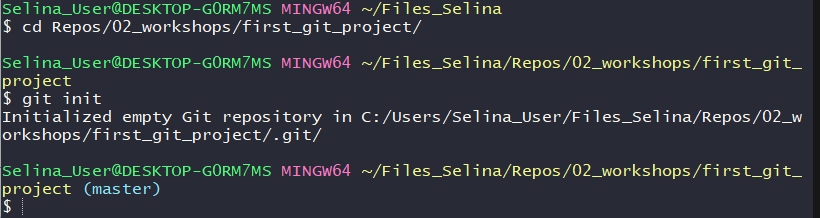
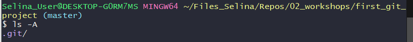
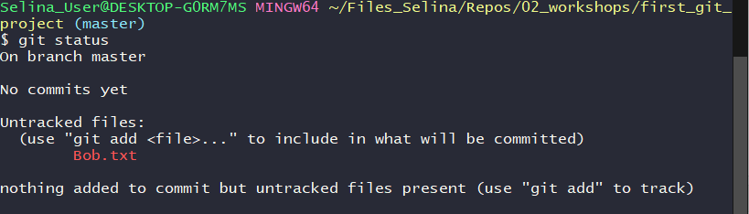
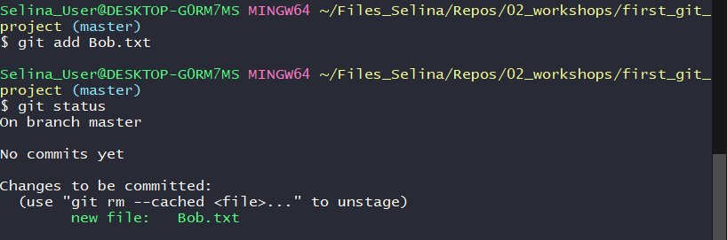

```{r setup, include=FALSE}
knitr::opts_chunk$set(echo = TRUE,
                      warning = FALSE,
                      message = FALSE)
library(fontawesome)
```

```{r child="title_slide.Rmd"}

```

---
class: inverse

.pull-left[
 
]

---
# What is Git?

.pull-left[
- Stores snapshots (i.e. commits) of your project files
  - like a mini-filesystem

]
.pull-right[

]

--

.pull-left[

- Distributed version control system
  - (usually) one remote and one or more local repositories
  - everyone has full copy of project

]
.pull-right[

]

---
# Why git?

- Complete and long-term history of every file in your project
  - Go back in time

--

- Documentation of every change
  - Who, what, when why?

--

- Repository on remote server (e.g. Github)
  - Additional backup
  - Access from browser
  - Share and collaborate
  - Sync between devices
  - Transparency

---
# Use cases

Git works best with **text files** (e.g. code), but you can also track other types of files

- Not good for very large files (there are other options such as git LFS)

---
# Topics of this workshop

Git is a huge topic. Most of the things are best to learn as you need them.

**Aim of this workshop:** Get started.

--

## Session 1

- Introduction to git concepts
- Simple git workflow for your projects

## Session 2

- Collaboration with git
  - Branching and merging
- Using git with R and RStudio

---
# Git core concepts I

## Some terminology

.pull-left[

- **Commit**
- **Repository / Repo:** database of the project (a `.git` folder in your project)
  - **local:** on a local machine (e.g. your computer)
  - **remote:** on a server (e.g. Github)
]
.pull-right[

]

---
# Git core concepts II

A git repository does not contain the files in a version that you can just open and edit.

.pull-left[
- **Repository:** 
  - Database of the project
  - Stores *all versions* of your project
- **Working directory:** 
  - Checkout *one version* of the project
  - Files can be edited here and then added into the repository
- **Staging area (index):** 
  - Collect changes to files here before commiting
  - Info of what goes into the next commit
]

.pull-right[
  
]

---
class: inverse

# Basic workflow for working alone

I will show you everything in the command line. There are also GUI programs for git that you can switch to but the concepts are better learned in the terminal.

---
# Step 1: Initialize a git repository `git init`

.center[]

---
# Step 1: Initialize a git repository `git init`

To use git in any project, just navigate to the project folder and run `git init`



--

This initializes a (hidden) `.git` folder that contains your git repository.



- You don't have to touch anything that is in this folder

---
# Step 2: Modify files and stage changes `git add`

.pull-left[
- git detects any changes in the working directory and marks them as 

  - untracked
  - modified
  - deleted
  
]

--

.pull-right[

]

--

- see whats going on with `git status`


---
# Step 2: Modify files and stage changes `git add`

.pull-left[
- Add files to the staging area with

  - Specific file: `git add <filename>`
  - All changed files: `git add .`
]

.pull-right[

]

--



---
# Step 3: Commit changes to the local repository `git commit`

.pull-left[
- Commits are basically snapshots of your projects

- Commit work from staging area to local repository

- Now your changes are part of your project's git history
]
.pull-right[

]

--


---
# Commit messages

- Every commit needs a commit message
- Good commit messages are essential to make good use of git!

--

.center[]

--

- One line commit messages can be given directly in the command line:
  - `git commit -m "Your very nice commit message"`
- More complex commit messages are better entered in a text editor:
  - `git commit` and a text editor will automatically open for you message
  
.footnote-left[Comic by [xkcd](https://xkcd.com/1296/)]

---
# Step 4: Share changes with a remote repository `git push`
